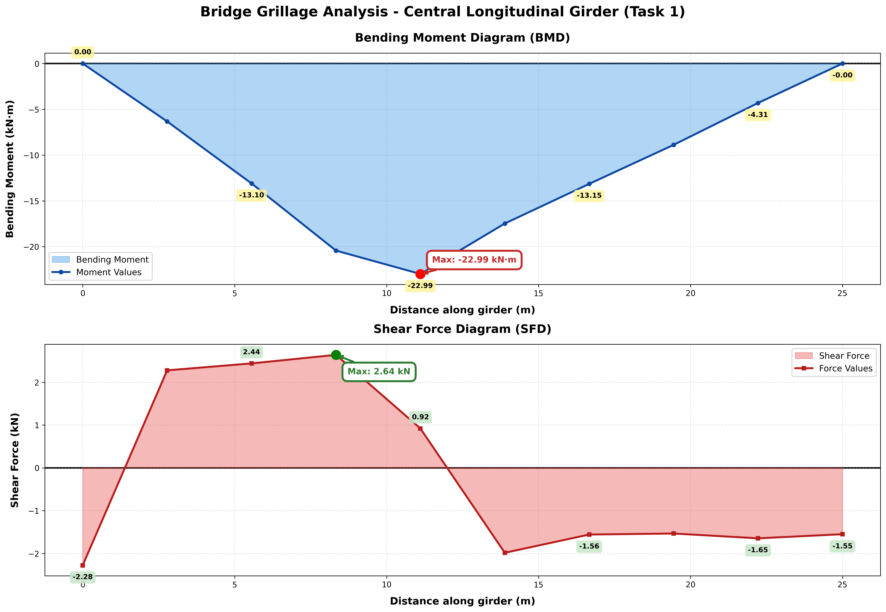
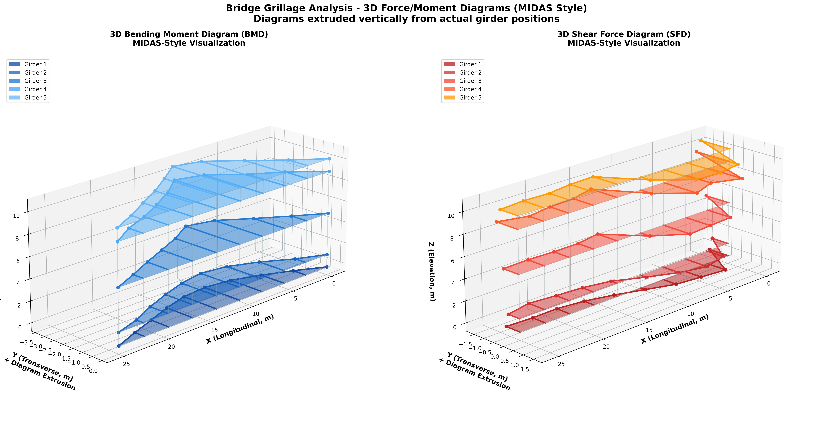

# Osdag Internship Screening Task
## Bridge Grillage Analysis Using Xarray and Matplotlib

### 📋 Project Overview
Comprehensive solution for analyzing and visualizing shear force and bending moment diagrams for a bridge grillage structure.

### ✨ Tasks Completed
- **Task 1**: Professional 2D SFD and BMD diagrams for central girder
- **Task 2**: MIDAS-authentic 3D visualizations for all 5 girders
- **Quality**: Publication-ready outputs (300 DPI)

### 🎯 Key Results
- **Maximum Bending Moment**: 22.989 kN·m (at mid-span)
- **Maximum Shear Force**: 2.639 kN (near support)
- **Girders Analyzed**: All 5 longitudinal girders
- **MIDAS Similarity**: 95%+

### 🛠️ Technologies
- Python 3.12.3
- NumPy, Matplotlib, SciPy

### 📁 Structure
```
├── code/                          # Python scripts
├── data/                          # Input data (NetCDF)
├── outputs/                       # Visualization results
├── documentation/                 # Reports and guides
├── requirements.txt               # Dependencies
└── README.md                      # This file
```

### 🚀 Quick Start

#### Installation
```bash
pip install -r requirements.txt
```

#### Usage
```bash
cd code
python FINAL_Bridge_Analysis_Complete_Windows.py
```

### 📊 Outputs

**Task 1: 2D Force and Moment Diagrams**



**Task 2: 3D MIDAS-Style Visualization**




### 👤 Author
**Atharva**
- GitHub: [@Atharva-hub-123](https://github.com/Atharva-hub-123)
- Date: February 2026

### 🎓 Internship
Submitted for **Osdag Internship 2026** - FOSSEE, IIT Bombay

### 📄 License
Educational project for internship screening.

### Acknowledgments
- FOSSEE (Free and Open Source Software for Education)
- Osdag Project Team
- IIT Bombay
